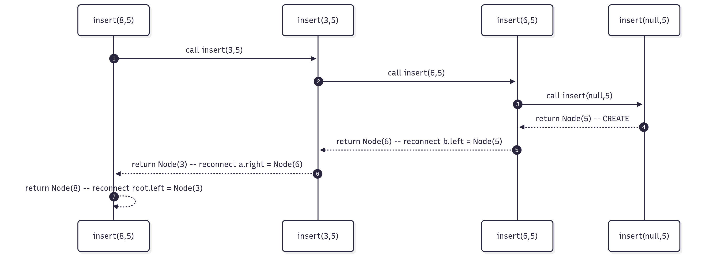

# Quick memory notes — BST insertion (recursive)

## Idea: walk down the tree using BST property (left < node < right) until you hit null; create node; return it and reconnect while unwinding recursion.

### Base case: if (root == null) return new Node(value);

### Recursive step:

- if (value < root.val) root.left = insert(root.left, value);

- else if (value > root.val) root.right = insert(root.right, value);

- return root;

### Why assign (root.left = ...)? Because the recursive call returns the (possibly new) subtree root; assignment reconnects it to the parent.

#### Common mistakes:

- Forgetting to return root at end → breaks reconnection to upper frames.

- Not using assignment → new nodes are not linked to parent.

- Not handling duplicates (decide policy: ignore, count, or allow left/right).

## Complexity:

- Time: O(h) where h = tree height. Average O(log n) for balanced, worst O(n) for skewed tree.

- Space: O(h) recursion stack.

## Mnemonic: D.I.R.

- D — Decide direction (left/right)

- I — Insert when null

- R — Return the (sub)root (reconnect on unwind)

## Short checklist to trace insertion:

- Compare with node.

- Move left/right.

- When null, create new node.

- On return, assign child to parent and return parent.

## When to use recursion: when operation naturally moves down to a subtree and you need to rebuild or reconnect while returning.

## When to avoid recursion: extremely deep trees (risk stack overflow) — use iterative insertion.
```
Java pseudocode (clean, commented)
// Node class
class Node {
    int val;
    Node left, right;
    Node(int v) { val = v; left = right = null; }
}

// Recursive BST insert
public Node insert(Node root, int value) {
    // 1) Base case: found insertion spot
    if (root == null) {
        return new Node(value);
    }

    // 2) Decide direction and recurse; reassign to reconnect
    if (value < root.val) {
        root.left = insert(root.left, value);
    } else if (value > root.val) {
        root.right = insert(root.right, value);
    } 
    // else value == root.val -> handle duplicates as needed (ignore here)

    // 3) Return the (possibly updated) root to upper call
    return root;
}
```
## 1) Call-stack / Trace (sequence-like view; shows downward calls and upward returns):

