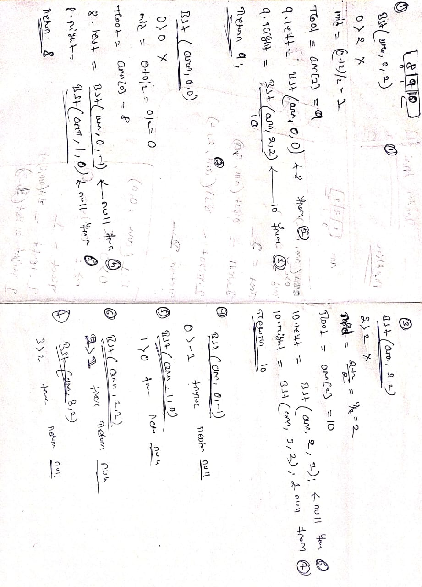

# Algorithm: Convert a Sorted Array to a Balanced BST

## Input: A sorted array arr[] of size n
## Output: Root node of a Balanced Binary Search Tree (BST)

## <b>Algorithm Steps:</b>

### Define a function sortedArrayToBST(arr, start, end)

- This function will recursively construct the BST.

## Base Case:

- If start > end, return null (no elements to form a subtree).

## Find Middle Element:

- Compute mid = (start + end) / 2

- The middle element arr[mid] becomes the root of the current subtree.

### Recursively Construct Subtrees:

- Build the left subtree using elements before mid:
- <mark>root.left = sortedArrayToBST(arr, start, mid - 1)</mark>

- Build the right subtree using elements after mid:
- <mark>root.right = sortedArrayToBST(arr, mid + 1, end)</mark>

### Return the root node.

# function call(unfold and rewind ) example with array [7,8,9];

## Unfold phase (top-down calls):
```
1. ➡️ fun(0,2)          // root 9
2. ➡️ fun(0,0)          // left subtree (8)
3. ➡️ fun(0,-1)         // left of 8 (null)
4. ⬅️ return null
5. ➡️ fun(1,0)          // right of 8 (null)
6. ⬅️ return null
7. ⬅️ return Node(8)    // 8’s subtree ready
8. ➡️ fun(2,2)          // right subtree (10)
9. ➡️ fun(2,1)          // left of 10 (null)
10. ⬅️ return null
11. ➡️ fun(3,2)         // right of 10 (null)
12. ⬅️ return null
13. ⬅️ return Node(10)  // 10’s subtree ready
14. ⬅️ return Node(9)   // final root returns
```

## 🪜 Order in which functions are CALLED (unfolding only):
```
1. fun(0,2)
2. fun(0,0)
3. fun(0,-1)
4. fun(1,0)
5. fun(2,2)
6. fun(2,1)
7. fun(3,2)
```

## 🔁 Order in which functions RETURN (rewinding phase):
```
1. fun(0,-1)
2. fun(1,0)
3. fun(0,0)
4. fun(2,1)
5. fun(3,2)
6. fun(2,2)
7. fun(0,2)
```

## stack stress ex [7,8,9];
